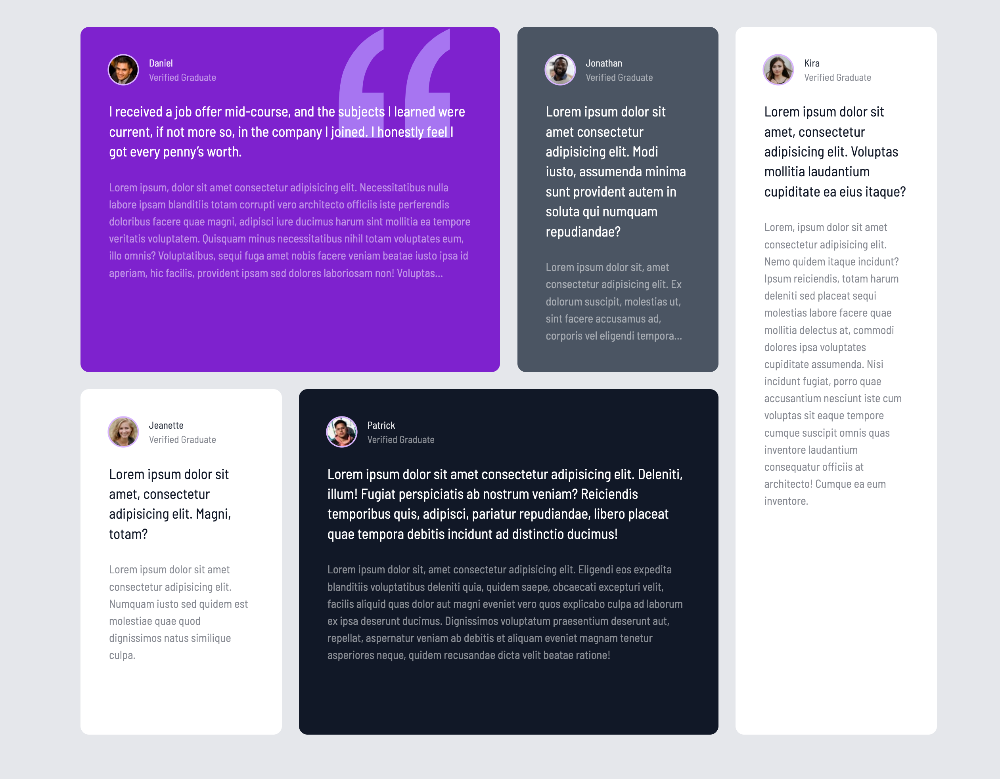
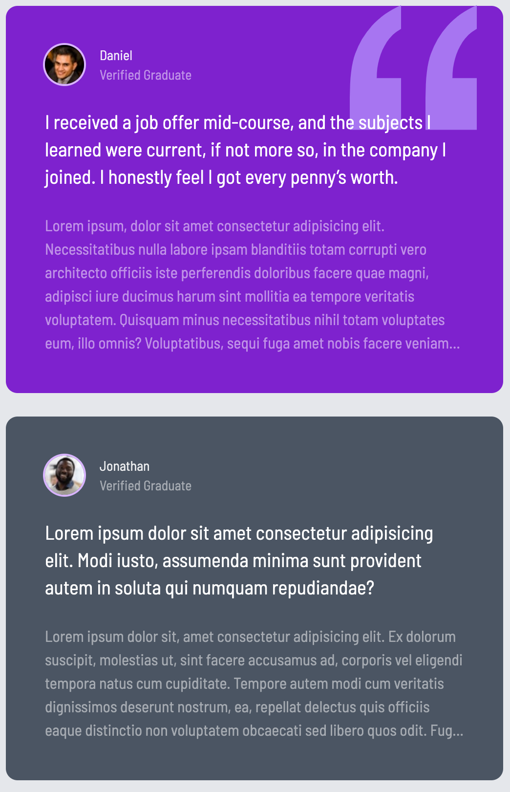

# Testimonial

## Project Overview

This project is a **Testimonial Grid Layout** webpage that displays various testimonials from users in a grid format. It is a fully responsive design that adapts well to different screen sizes. The design emphasizes the use of space and typography to create a visually appealing layout.

## Features

- **Responsive Layout**: The grid adapts to different screen sizes, ensuring the testimonials are displayed beautifully on both mobile and desktop devices.
- **Grid System**: Uses CSS Grid to organize the testimonials in an intuitive manner.
- **Custom Styling**: Implements a modern design using Tailwind CSS for a clean and responsive UI.
- **Typography & Images**: Testimonials include user images and text styled for readability and aesthetics.

## Tech Stack

- **HTML5**: Structure of the webpage.
- **CSS3**: Styling, including the grid layout and responsiveness.
- **Tailwind CSS**: Utility-first CSS framework used to style the page.

## Getting Started

### Prerequisites

To run this project locally, ensure you have the following installed:

- A modern web browser

### Running the Project

1. Clone the repository to your local machine:

   ```bash
   git clone https://github.com/penn201500/testimonial
   ```

2. Open `index.html` in your browser to view the site.

## Screenshots

<p>
  
  <p>Desktop</p>
  
  <p>Mobile</p>
</p>

## Live Demo

You can view a live demo of this project [here](https://vercel.com).

## Contributing

If you'd like to contribute, feel free to open a pull request or create an issue.

## License

This project is licensed under the MIT License.
